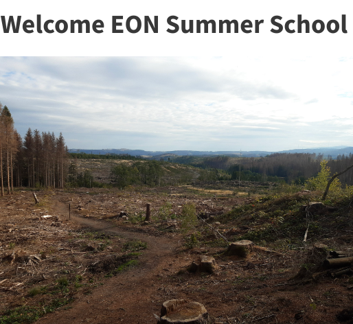
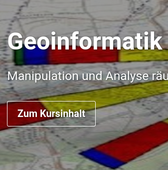
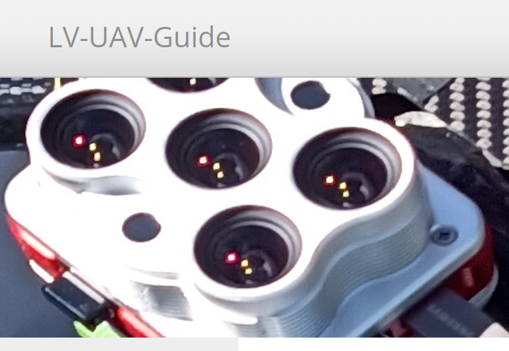
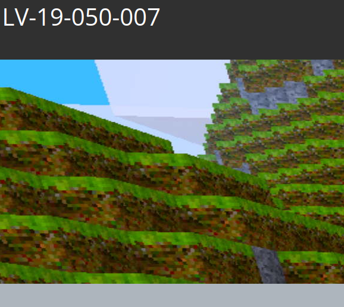
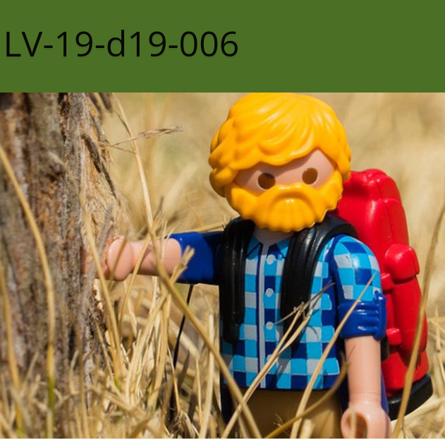
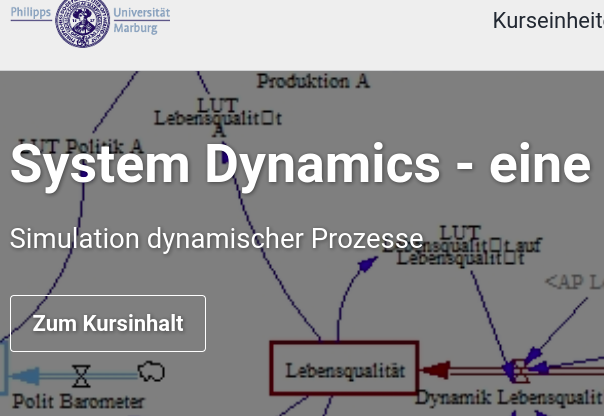
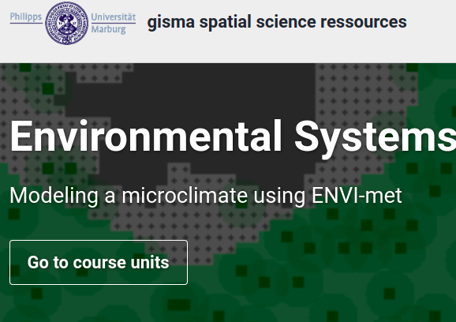
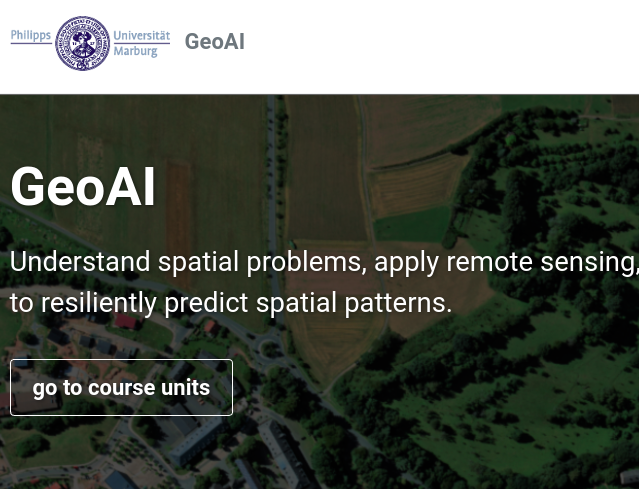
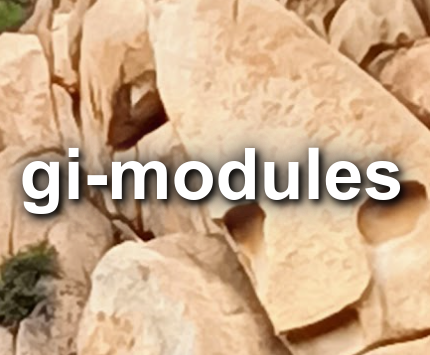

<!-- Main -->

<!-- One -->

<section id="one">
	

		<header class="major">
			<h1>About gisma courses</h1>
		</header>
		

The courses are all regular courses in the Bachelor's and Master's programmes in Geography at the University of Marburg. These courses are offered by the Geoinformation Science Lab Marburg (gisma), which provides access to various teaching and research contents of the working group Spatial Science Resources at the <a href="https://www.uni-marburg.de/en/fb19"> Department of Geography </a>,<a href="https://www.uni-marburg.de/en"> Marburg University  </a>.

 The course content is developed and hosted on
 <i class="fa fa-github"></i> <a href="https://github.com/gisma-courses/"> GitHub</a>
 
The responsibility for the content rests with the instructors. Statements, opinions and/or conclusions are the ones from the instructors and do not necessarily reflect the opinion of the representatives of Marburg University.  

		

	

</section>

<!-- Two -->

<!-- NEW -->
<section id="two" class="spotlights">
			

			<header class="major">
			<h1>Regular Courses</h1>
			
		</header>
		

	<section>
		
		

			

				<header class="major">
					<h3>Geoinformatics methods - Summerschool Remote Sensing Forest Monitoring Harz (QGIS)</h3>
				</header>
				

Remote Sensing Forest Monitoring Harz is a one-week summer school as an interdisciplinary workshop in which students of Forest Sciences from Göttingen and Geography (B.Sc. and M.Sc. Physical Geography) from Marburg work together. The aim is to use remote sensing techniques such as satellite data, UAV flights, terrestrial LiDAR data acquisition and microclimate detection using LoRa sensors for monitoring forest ecosystems. The workshop will include guided tours of the national park, input sessions on remote sensing data analysis and work on individual projects in small groups composed of participants from the different study programmes. 

				

				<ul class="actions">
					<li><a href="https://gisma-courses.github.io/EON2024/" >
					
German only | Start Course
</a></li>
				</ul>
			

		

	</section>

<!-- NEW -->

	<section>
		
		

			

				<header class="major">
					<h3>Geoinformatics methods - Basic geoinformatics course (QGIS)</h3>
				</header>
				

Spatial and temporal data and their manipulation, analysis and representation are fundamental scientific elements of geography. Analyses form the basis of knowledge in research, and the resulting media are the central means of communication. Data, data analysis and modelling are therefore an integral part of professional understanding. The basic handling of data, its preparation, visual exploration, analysis and presentation is an important core competence for the job description of a geographer. This course is the basic GIS course for geographers.

				

				<ul class="actions">
					<li><a href="https://gisma-courses.github.io/geoinfo-basis-qgis/" >
					
German only | Start Course
</a></li>
				</ul>
			

		

	</section>

<!-- NEW -->

	<section>
		
		

			

				<header class="major">
					<h3>Geoinformatics methods  - UAV based Remote Sensing workflows </h3>
				</header>
				

The Micro Remote Sensing course provides a complete introduction to the reproducible acquisition, pre-processing and exemplary analysis of high-resolution UAV-based imagery threat data using open source software.
This course is designed for students of all levels who have a basic knowledge of the organisation of their operating system. Programming skills are not required, but will be helpful for the advanced module, Analysis of high-resolution aerial imagery. The focus is on a practical approach to the independent acquisition of high resolution aerial data. Post-processing of products and an introduction to classification and analysis of the generated data sets complete the course.
				

				<ul class="actions">
					<li><a href="https://gisma-courses.github.io/LV-uav-workflow/" class="button">Start Course</a></li>
				</ul>
			

		

	</section>
	
<!-- NEW -->

	<section>
		
		

			

				<header class="major">
					<h3>Geoinformatics methods - Remote Sensing Change Detection</h3>
				</header>
				

The course Methods of Geoinformatics - Change Detection provides a complete introduction to reproducible land surface/land use change detection using R and open source software.
The course is aimed at undergraduate students of geography who have a basic knowledge of the organisation of their operating system.				

				<ul class="actions">
					<li><a href="https://gisma-courses.github.io/LV-19-050-007/"> 
German only | Start Course
</a></li>
				</ul>
			

		

	</section>

<!-- NEW -->

	<section>
		
		

			

				<header class="major">
					<h3>Geoinformatics methods - Statistical Micro Climate Modelling </h3>
				</header>
				

Geoinformatics Methods - Statistical Micro Climate Modelling is a full semester overview of selected methodological approaches in advanced GIS analysis using reproducible research workflows based on R and open source software and a full integration of GitHub. The course is aimed at Masters level geographers who have a working knowledge of the basic organisation of their operating system as well as basic knowledge of GI concepts and scripting. The scientific topic is statistical modelling of forest microclimate based on LiDAR and sentinel datasets and station measurements.
				

				<ul class="actions">
					<li><a href="https://gisma-courses.github.io/LV-19-d19-006/" class="button">Start Course</a></li>
				</ul>
			

		

	</section>

<!-- NEW -->

	<section>
		
		

			

				<header class="major">
					<h3>Geoinformatics methods - Big Data and Spatial Econometrics </h3>
				</header>
				

Spatio-temporal data analysis, especially of big data, and spatio-temporal prediction on these data are typical requirements of spatial econometrics. The adequate analysis of spatial data and the reliable assessment of spatial correlations are the basis for many economic decision-making processes. For communication purposes, appropriate visualisations and geomedia have to be created. The basic handling of data, preparation, visual exploration, analysis and presentation are taught in this course as an important core competence for spatial economic and social processes.

				

				<ul class="actions">
					<li><a href="https://gisma-courses.github.io/r-spatial-econometry-basics/"> 
German only | Start Course
</a></li>
				</ul>
			

		

	</section>
	
<!-- NEW -->

	<section>
		
		

			

				<header class="major">
					<h3>Geoinformatics methods - System Dynamics, an introduction
Simulation of dynamic processes </h3>
				</header>
				

The understanding of spatio-temporal processes, the delineation and modelling of such systems, and the simulation of specific system dynamics are becoming increasingly important in society and science. Geography, as an interdisciplinary science, plays an important role here. Analyses carried out on the basis of models form the basis for gaining knowledge in research. The resulting media and their interpretation are also central means of communication in research, but also for decision-makers and the formation of public opinion.

				

				<ul class="actions">
					<li><a href="https://gisma-courses.github.io/bsc-systemdynamik/"> 
German only | Start Course
</a></li>
				</ul>
			

		

	</section>
	
<!-- NEW -->

	
<!-- NEW -->

	<section>
		
		

			

				<header class="major">
					<h3>Geoinformatics methods  - Forest physical microclimate modelling </h3>
				</header>
				

Forest ecosystems have highly variable microclimates that also differ significantly from the surrounding climate. In the forest, direct solar radiation and wind speed are greatly reduced, leading to a moderation of extreme climates. The magnitude and even more the processes of these differences, especially in a highly structured and relief forest, are significant. This course will attempt to predict the spatio-temporal high resolution heterogeneity of microclimates using the modelling software ENVI-met.

				https://gisma-courses.github.io/moer-mpg-envisys-envi-met/
				

				<ul class="actions">
					<li><a href="https://gisma-courses.github.io/moer-mpg-envisys-envi-met/" class="button">Start Course</a></li>
				</ul>
			

		

	</section>
	
<!-- NEW -->

	<section>
		
		

			

				<header class="major">
					<h3>Media Competence in Geography</h3>
				</header>
				

Media and models are fundamental scientific elements of geography. They form the basis for gaining knowledge in research and serve as a means of communication. Media and models are therefore not primarily a pedagogical element, but an integral part of the professional study of a topic.

				

				<ul class="actions">
					<li><a href="	https://geomoer.github.io/moer-meko/"> 
German only | Start Course
</a></li>
				</ul>
			

		

	</section>
<!-- NEW -->	
		<section>
		
		

			

				<header class="major">
					<h3> Extracurricular learning locations (Ausserschulische Lernorte AsLo)</h3>
				</header>
				

Extracurricular learning locations allow the direct processing of geographical subject matter in real space. In this module, you will develop learning locations that are resilient, adaptive, vulnerable or mal-adaptive in terms of climate change education and work out what this means for the space. Based on the thematic development, you will carry out a methodical elaboration so that you can transfer the content into a 60-minute excursion and achieve knowledge transfer and awareness-raising for the local conditions. 
				

				<ul class="actions">
					<li><a href="https://ogerhub.github.io/aslo/"> 
German only | Start Course
</a></li>
				</ul>
			

		

	</section>

<!-- NEW -->

</section>

<!-- Three -->
<section id="three" class="spotlights">
	

		<header class="major">
			<h1>Former Courses</h1>
			<h2>Oldies but Goodies</h2>
		</header>
		
<section>
		

<h4>GIS Modules Bachelor 2010/2011</h4>

As they are still in demand, they are linked here: GISMA's first two German-language GIS learning modules based on learning theory. 

At that time, the online learning materials were intended to provide a clearly structured knowledge base that was aligned with the course objectives and that demanded and supported self-directed learning.
The online offering was based on a constructivist understanding of didactics in terms of learning theory.
All courses were structured as blended learning modules, i.e. they included periods of attendance and periods of self-directed learning. However, the courses are also suitable for self-study. All courses are available as SCORM/IMS modules for any learning platform. 

Please note that as the technology is over 15 years old, there may be errors in the presentation.
As they are still in demand, they are linked here: GISMA's first two German-language GIS learning modules based on learning theory. 

At that time, the online learning materials were intended to provide a clearly structured knowledge base that was aligned with the course objectives and that demanded and supported self-directed learning.
The online offering was based on a constructivist understanding of didactics in terms of learning theory.
All courses were structured as blended learning modules, i.e. they included periods of attendance and periods of self-directed learning. However, the courses are also suitable for self-study. All courses are available as SCORM/IMS modules for any learning platform. 

Please note that due to over 10 years of technology, there may be errors in the presentation.

		

		<ul class="actions">
			<li><a href="http://gisbsc.gis-ma.org/GISBScL1/de/html/index.html" > 
German only | GIS Modul 2010
</a></li>
				<li><a href="http://minibsc.gis-ma.org/GISBScL1/de/html/index.html">  
German only | GIS Modul 2011
</a></li>
		</ul>

		

</section>

<section>
		
		

			

				<header class="major">
					<h3>GeoAI - use AI to predict spatial patterns</h3>
				</header>
				

Understanding environmental change and assessing its consequences requires spatial information about landscapes. The key question is not whether a landscape contains forest, meadow, field and river, but how they relate spatially to each other. When collecting spatial information in the field, a trade-off must be made between level of detail, scale and temporal repetition. Selected processes can either be studied in detail at a very limited number of observation sites, or estimated at a generalised scale for a landscape. The constraints are relaxed when local surveys are combined with area-wide remote sensing observations, and the locally collected information is predicted in space using artificial intelligence methods.
				

				<ul class="actions">
					<li><a href="https://geomoer.github.io/geoAI/" class="button">Start Course</a></li>
				</ul>
			

		

	</section>
	
	<section>

		 
	
			

	
			

				<header class="major">
					<h3>Gi-Modules</h3>
				</header>
				

GI Modules is a blog-based collection of learning content in the broad field of geoinformatics. The blogs are sorted by categories and tags. Under the categories, related content is grouped together. Within the content pages, you can navigate to related articles via the tags.
The contents are therefore thematically associated but not intended as a closed workflow. The course units are composed of individual modules.
				

				<ul class="actions">
					<li>
					<a href="https://gisma-courses.github.io/gi-modules/" class="button">Start Course</a>
					</li>
				</ul>
			

		

	</section>

<!-- NEW -->

