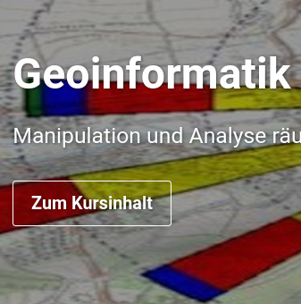
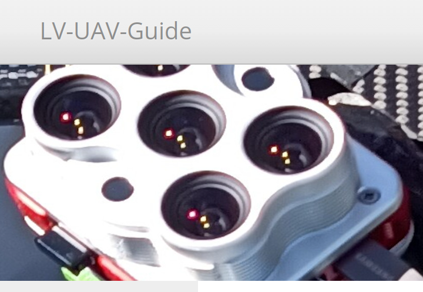
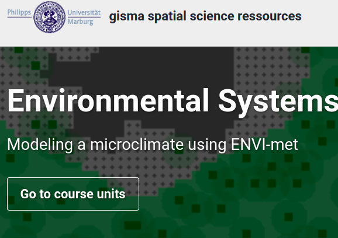
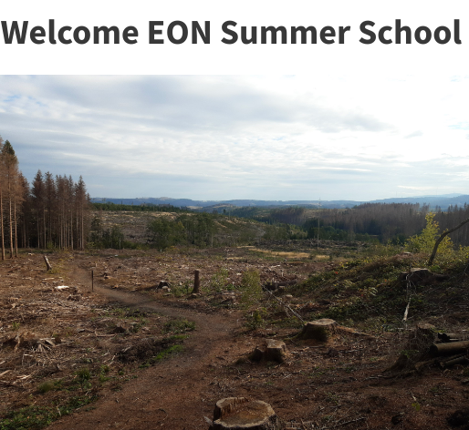
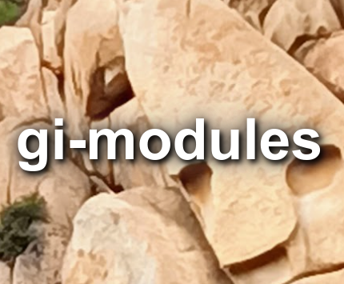
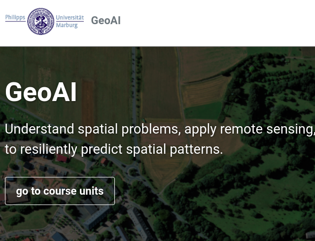
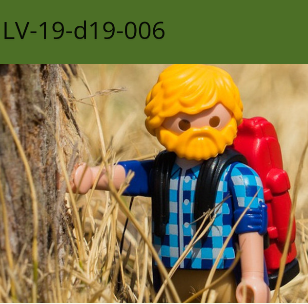
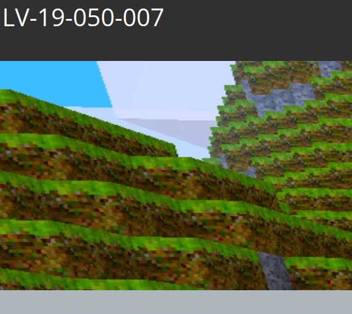
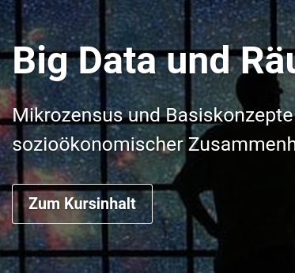
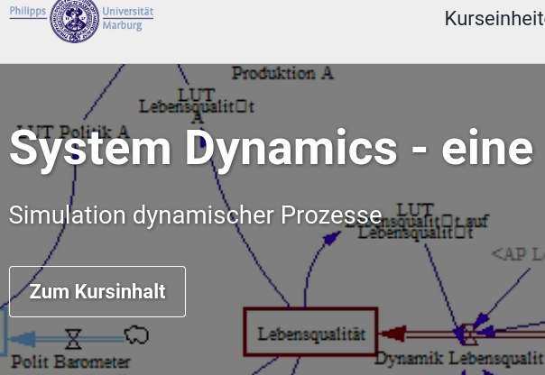

<!-- Main -->

<!-- One -->
<section id="one">

<header class="major">
<h1>About gisma courses</h1>
</header>

The courses are all regular courses in the Bachelor's and Master's programmes in Geography at the University of Marburg. These courses are offered by the Geoinformation Science Lab Marburg (gisma), which provides access to various teaching and research contents of the working group Spatial Science Resources at the <a href="https://www.uni-marburg.de/en/fb19"> Department of Geography </a>,<a href="https://www.uni-marburg.de/en"> Marburg University  </a>.

The course content is developed and hosted on <i class="fa fa-github"></i> <a href="https://github.com/gisma-courses/">GitHub</a>.

The responsibility for the content rests with the instructors. Statements, opinions and/or conclusions are the ones from the instructors and do not necessarily reflect the opinion of the representatives of Marburg University.

</section>

<section id="two" class="spotlights">

<header class="major">
<h1>Regular Courses</h1>
<h2>Current course pages and teaching resources from the last two years</h2>
</header>

<!-- NEW -->
<section>

<header class="major">
<h3>KlimaLab Schülerlabor 2026 - KlimaCheck Schulhof</h3>
</header>

KlimaLab Schülerlabor 2026 is a student laboratory on climate change, climate evidence and AI-supported learning. Students work through stations on how climate change is measured, analysed and modelled, while also reflecting critically on when AI supports learning and when it replaces their own understanding.

<ul class="actions">
<li><a href="https://ogerhub.github.io/KlimaCheck-Schulhof/">
German only | Start Course
</a></li>
</ul>

</section>

<!-- NEW -->
<section>

<header class="major">
<h3>Geoinformatics methods - Basic geoinformatics course (QGIS)</h3>
</header>

Spatial and temporal data, their manipulation, analysis and representation are fundamental scientific elements of geography. The course introduces geodata types, visual exploration, GIS-based analysis, presentation and reproducible workflows as core competences for geographers.

<ul class="actions">
<li><a href="https://gisma-courses.github.io/gc-geoinfo/">
German only | Start Course
</a></li>
</ul>

</section>

<!-- NEW -->
<section>

<header class="major">
<h3>Micro-Remote Sensing - UAV based Remote Sensing workflows</h3>
</header>

The Micro Remote Sensing course offers a comprehensive introduction to reproducible flight planning, UAV-based data acquisition, pre-processing and example-based analysis of high-resolution, low-cost image data using commercial and open-source software tools.

<ul class="actions">
<li><a href="https://gisma-courses.github.io/LV-19-050-228/" class="button">Start Course</a></li>
</ul>

</section>

<!-- NEW -->
<section>

<header class="major">
<h3>Advanced GIS and Remote Sensing - Rainfall Monitoring Network Design</h3>
</header>

Advanced GIS and Remote Sensing is a project-oriented course on the design, analysis and evaluation of spatially explicit hydrological monitoring networks. The course goal is to develop a reproducible and defensible rain-gauge network concept for the Kellerwald region by connecting spatial reasoning, remote-sensing data and hydrological process understanding.

<ul class="actions">
<li><a href="https://gisma-courses.github.io/LV-19-d19-006-25/" class="button">Start Course</a></li>
</ul>

</section>

<!-- NEW -->
<section>

<header class="major">
<h3>TLS Tree Climate - Tree Structure, Species and Energy Flow</h3>
</header>

This course explores how trees shape climate through structure, species and energy flow. It combines laser scans, land data and physical models to analyse atmosphere-vegetation interaction, surface energy fluxes, TLS and ALS point clouds, tree species classification and simulation-ready microclimate domains.

<ul class="actions">
<li><a href="https://gisma-courses.github.io/tls-tree-climate/" class="button">Start Course</a></li>
</ul>

</section>

<!-- NEW -->
<section>

<header class="major">
<h3>Microclimate Modeling - ENVI-met</h3>
</header>

Microclimate Modeling introduces ENVI-met as a 3D micro-climate simulation environment for urban planning, architectural design and energy-related applications. The course covers materials, vegetation, weather-file preparation, model-domain generation, simulation runs, visualisation and interpretation of microclimate results.

<ul class="actions">
<li><a href="https://gisma-courses.github.io/LV-19-d19-010-envi/" class="button">Start Course</a></li>
</ul>

</section>

<!-- NEW -->
<section>

<header class="major">
<h3>Advanced GIS and Remote Sensing - Spatial Pattern Analysis</h3>
</header>

Advanced GIS and Remote Sensing introduces advanced geoinformatics methods for spatio-temporal analysis, regionalisation and spatial pattern description. The course focuses on adapting and developing GIS methods, designing suitable workflows, critically evaluating spatio-temporal analyses and communicating workflows and results.

<ul class="actions">
<li><a href="https://gisma-courses.github.io/LV-19-d19-006-24/" class="button">Start Course</a></li>
</ul>

</section>

<!-- NEW -->
<section>

<header class="major">
<h3>EON Summer School 2024 - Remote Sensing Forest Monitoring Harz</h3>
</header>

Remote Sensing Forest Monitoring Harz is a one-week interdisciplinary summer school in which students of Forest Sciences from Göttingen and Geography from Marburg work together. The course uses satellite data, UAV flights, terrestrial LiDAR data acquisition and microclimate sensing for monitoring forest ecosystems.

<ul class="actions">
<li><a href="https://gisma-courses.github.io/EON2024/">
German only | Start Course
</a></li>
</ul>

</section>

<!-- NEW -->
<section>

<header class="major">
<h3>Extracurricular learning locations (Ausserschulische Lernorte AsLo)</h3>
</header>

Extracurricular learning locations allow the direct processing of geographical subject matter in real space. In this module, students develop learning locations that are resilient, adaptive, vulnerable or maladaptive in relation to climate change and translate the topic into a 60-minute excursion.

<ul class="actions">
<li><a href="https://ogerhub.github.io/aslo/">
German only | Start Course
</a></li>
</ul>

</section>

</section>

<section id="three" class="spotlights">

<header class="major">
<h1>Former Courses</h1>
<h2>Oldies but Goodies</h2>
</header>

<!-- NEW -->
<section>

<header class="major">
<h3>GI Modules - Geoinformatics Learning Collection</h3>
</header>

GI Modules is a blog-based collection of learning content in the broad field of geoinformatics. The blogs are sorted by categories and tags; the material is thematically associated but not intended as a single closed workflow.

<ul class="actions">
<li><a href="https://gisma-courses.github.io/gi-modules/" class="button">Start Course</a></li>
</ul>

</section>

<!-- NEW -->
<section>

<header class="major">
<h3>GeoAI - use AI to predict spatial patterns</h3>
</header>

GeoAI focuses on understanding spatial problems, applying remote sensing and using AI to predict spatial patterns. The course links local surveys with area-wide remote sensing observations and machine-learning methods for human-environment research.

<ul class="actions">
<li><a href="https://geomoer.github.io/geoAI/" class="button">Start Course</a></li>
</ul>

</section>

<!-- NEW -->
<section>

<header class="major">
<h3>Advanced GIS and Remote Sensing - GIS Workflows 2023</h3>
</header>

This course version covers advanced GIS and remote-sensing workflows, with QGIS, DEM analysis, watershed concepts, working-environment setup, remote-sensing projects and reproducible analysis workflows. It emphasises method adaptation, workflow design, critical evaluation and communication of results.

<ul class="actions">
<li><a href="https://gisma-courses.github.io/LV-19-d19-006-23/" class="button">Start Course</a></li>
</ul>

</section>

<!-- NEW -->
<section>

<header class="major">
<h3>Agent-based Modelling - Abstraction and Model Building</h3>
</header>

Agent-based Modelling introduces modelling as a transparent but necessarily selective abstraction of complex reality. The course focuses on how scientific concepts and general ideas can be translated into model structures, and how bottom-up and top-down approaches can be used to develop and understand models in NetLogo.

<ul class="actions">
<li><a href="https://gisma-courses.github.io/LV-19-050-189-ABM/">
German only | Start Course
</a></li>
</ul>

</section>

<!-- NEW -->
<section>

<header class="major">
<h3>Geoinformatics methods - Statistical Micro Climate Modelling</h3>
</header>

Geoinformatics Methods - Statistical Micro Climate Modelling is a full semester overview of selected methodological approaches in advanced GIS analysis using reproducible research workflows based on R and open-source software. The scientific topic is statistical modelling of forest microclimate based on LiDAR, Sentinel data and station measurements.

<ul class="actions">
<li><a href="https://gisma-courses.github.io/LV-19-d19-006/" class="button">Start Course</a></li>
</ul>

</section>

<!-- NEW -->
<section>

<header class="major">
<h3>Geoinformatics methods - Remote Sensing Change Detection</h3>
</header>

The course Methods of Geoinformatics - Change Detection provides an introduction to reproducible land-surface and land-use change detection using R, open-source software and GitHub-based workflows. It is aimed at geography students with basic operating-system knowledge.

<ul class="actions">
<li><a href="https://gisma-courses.github.io/LV-19-050-007/">
German only | Start Course
</a></li>
</ul>

</section>

<!-- NEW -->
<section>

<header class="major">
<h3>Geoinformatics methods - Big Data and Spatial Econometrics</h3>
</header>

Spatio-temporal data analysis, especially of big data, and spatio-temporal prediction are typical requirements of spatial econometrics. The course introduces spatial data handling, preparation, visual exploration, analysis and presentation as core competences for spatial economic and social processes.

<ul class="actions">
<li><a href="https://gisma-courses.github.io/r-spatial-econometry-basics/">
German only | Start Course
</a></li>
</ul>

</section>

<!-- NEW -->
<section>

<header class="major">
<h3>Advanced GIS and Remote Sensing - GIS Workflows 2022</h3>
</header>

This earlier Advanced GIS and Remote Sensing course version belongs to the same advanced geoinformatics sequence and keeps the focus on reproducible spatial workflows, geoinformatics methods, remote-sensing input data and critical analysis of spatio-temporal patterns.

<ul class="actions">
<li><a href="https://gisma-courses.github.io/LV-19-d19-006-22/" class="button">Start Course</a></li>
</ul>

</section>

<!-- NEW -->
<section>

<header class="major">
<h3>Geoinformatik Basiskurs (QGIS)</h3>
</header>

This basic geoinformatics course introduces fundamental GIS concepts, QGIS workflows, geodata representation, spatial analysis and map-based communication. It is an earlier course version and remains useful as a reference for core QGIS teaching material.

<ul class="actions">
<li><a href="https://gisma-courses.github.io/geoinfo-basis-qgis/">
German only | Start Course
</a></li>
</ul>

</section>

<!-- NEW -->
<section>

<header class="major">
<h3>Geoinformatics methods - System Dynamics, an introduction</h3>
</header>

The course introduces the understanding of spatio-temporal processes, the delineation and modelling of systems and the simulation of system dynamics. It treats modelling and simulation as scientific means of knowledge production and communication in geography.

<ul class="actions">
<li><a href="https://gisma-courses.github.io/bsc-systemdynamik/">
German only | Start Course
</a></li>
</ul>

</section>

<!-- NEW -->
<section>

<header class="major">
<h3>Methods of Geoinformatics - Basic Course</h3>
</header>

This older basic geoinformatics course introduces the manipulation and analysis of spatial data for bachelor-level geography. It covers geodata types, visualisation, GIS-based representation of real-world processes and a small independent project report.

<ul class="actions">
<li><a href="https://gisma-courses.github.io/bsc-geoinfo-basic/">
German only | Start Course
</a></li>
</ul>

</section>

<!-- NEW -->
<section>

<header class="major">
<h3>Media Competence in Geography</h3>
</header>

Media Competence in Geography treats media and models as scientific instruments of geography. The course focuses on categorising geomedia, producing examples, modelling spatial processes and reflecting on the suitability of media for specific geographical problems.

<ul class="actions">
<li><a href="https://geomoer.github.io/moer-meko/">
German only | Start Course
</a></li>
</ul>

</section>

</section>

<section id="four" class="spotlights">

<header class="major">
<h1>GISMA Back Catalogue</h1>
<h2>Useful classics and legacy teaching material</h2>
</header>

<!-- NEW -->
<section>

<header class="major">
<h3>GIS Modules Bachelor 2010/2011</h3>
</header>

GISMA's first two German-language GIS learning modules are preserved here because they are still occasionally useful as historical teaching resources. They were designed as blended-learning modules with structured knowledge bases, self-directed learning phases and SCORM/IMS-compatible material. Because the technology is now substantially outdated, display errors and broken interactions are possible.

<ul class="actions">
<li><a href="http://gisbsc.gis-ma.org/GISBScL1/de/html/index.html">
German only | GIS Modul 2010
</a></li>
<li><a href="http://minibsc.gis-ma.org/GISBScL1/de/html/index.html">
German only | GIS Modul 2011
</a></li>
</ul>

</section>

</section>

