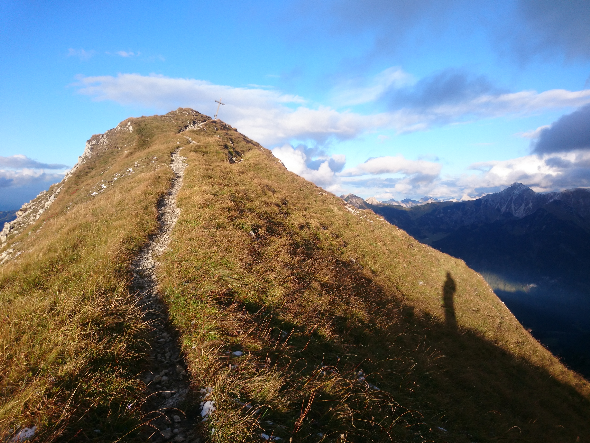

<section class="page-hero compact" style="--hero-image: url('assets/images/gisma-1.jpg')">
  

    <h1>GiS-Lab Marburg</h1>
    
gisma spatial science resources  courses blogs & opinons.

  

</section>

<section class="content-band">

## About

The Geoinformation Science Lab Marburg (gisma) provides access to various teaching and research contents of the working group Spatial Science Resources at the University of Marburg. [Department of Geography](https://www.uni-marburg.de/en/fb19), [Philipps-University Marburg](https://www.uni-marburg.de/en).

The main goal of this site is to make geoinformatics concepts and content available in different formats - from blog posts to single tutorials to complete courses.
The focus is on reproducible training in the scientific method in the fields of environmental informatics, GIS remote sensing and modelling.

</section>

<section class="spotlight-section">
  
  

    

      <h3>Teaching backgrounds</h3>
      
In recent decades there has been a shift in pedagogy from the object of learning to the subject of learning. Learners are no longer seen as passive or active recipients, but as active constructors, accompanied by crises. An authentic problem orientation plays a crucial role in a successful learning environment. In the best case, teaching focuses on questions that are meaningful to the learners, that make them curious and/or concerned.

      
<a class="button" href="teaching.html">Learn more</a>

    

  

</section>

<section class="spotlight-section">
  
  

    

      <h3>Theses & Evaluation</h3>
      
The most important basis is commitment and enjoyment of the (self-imposed) task. You should also be prepared to write an exposé at the beginning of your work, which will serve as a basis for supervision and as an outline for the final project. You can be sure that you will be supervised with the same commitment that you put into your own work.

      
<a class="button" href="theses-assessment.html">Learn more</a>

    

  

</section>

<section class="spotlight-section">
  
  

    

      <h3>Courses</h3>
      
Courses

      
<a class="button" href="courses.html">Learn more</a>

    

  

</section>

