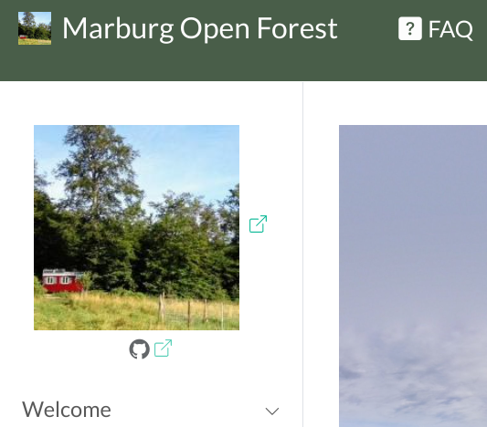
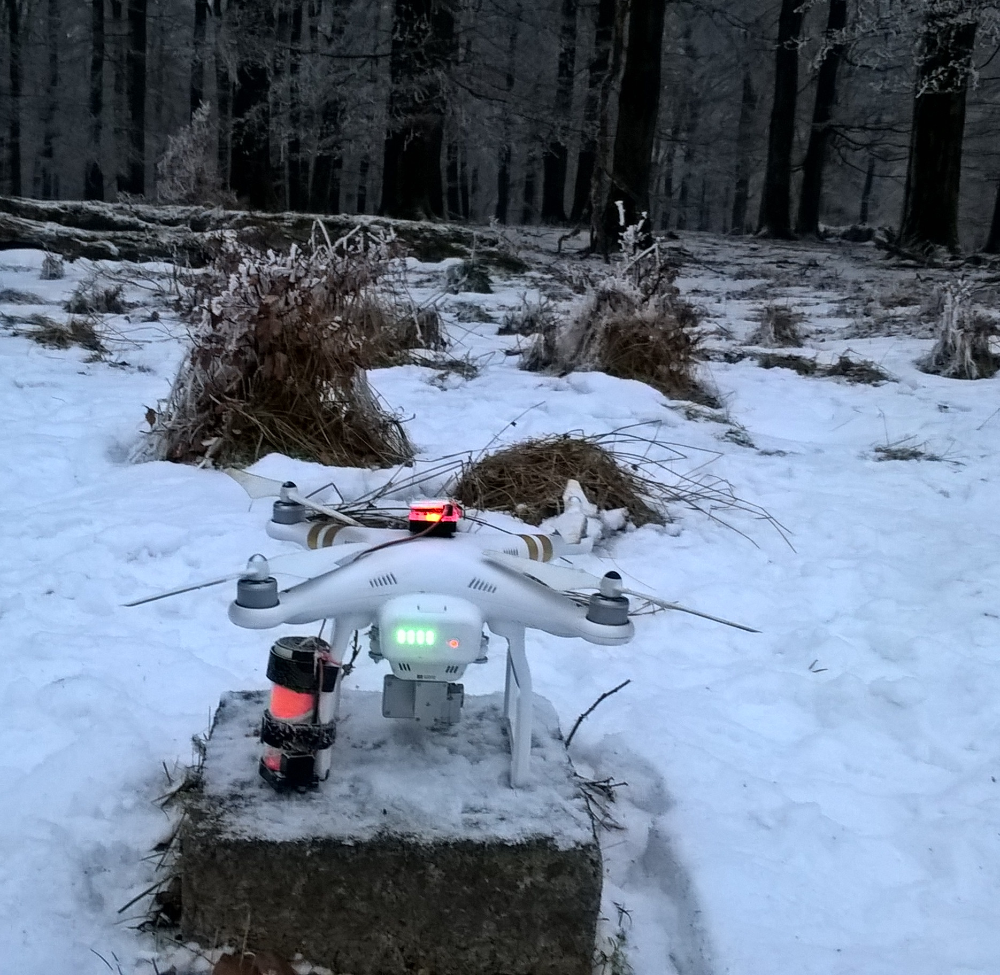
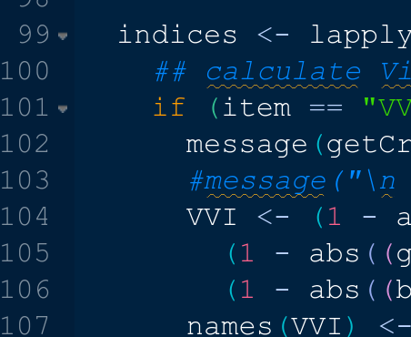

<section class="page-hero compact" style="--hero-image: url('assets/images/climatroof-sp.2.jpg')">
  

    <h1>Software and Data</h1>
    
UAV Data and Software Tools provides by Geoinformation Science Lab Marburg

  

</section>

<section class="spotlight-section">
  
  

    

      <h3>Marburg Open Forest</h3>
      
The Marburg Open Forest Knowledge Web provides access to data and resources from the Marburg University Forest. These resources have been collected since 2016 as part of research and teaching at the Institute of Geography at the University of Marburg.

      
<a class="button" href="https://marburgopenforest.github.io/MOFknowledge/">Learn more</a>

    

  

</section>

<section class="spotlight-section">
  
  

    

      <h3>UAV Data sets</h3>
      
Since 2016, image and measurement data has been collected using drone flights as part of research and teaching, and as this involves large amounts of data, making it available via the internet is associated with some problems. The currently processed data is made available for viewing and downloading on the temporary web database droneDB.

      
<a class="button" href="http://137.248.191.201:5000/r/uav">Learn more</a>

    

  

</section>

<section class="spotlight-section">
  

    
  

  

    

      <h3>Software</h3>
      
The software listed here are the currently maintained R packages and scripts.

      <ul>
        <li><a href="https://r-spatial.github.io/link2GI/">link2GI</a></li>
        <li><a href="https://gisma.github.io/uavRmp/">uavRmp</a></li>
        <li><a href="https://github.com/gisma/MetashapeTools">Metashape Tools</a></li>
      </ul>
      
<a class="button" href="https://github.com/gisma?tab=repositories">Learn more at GitHub</a>

    

  

</section>

